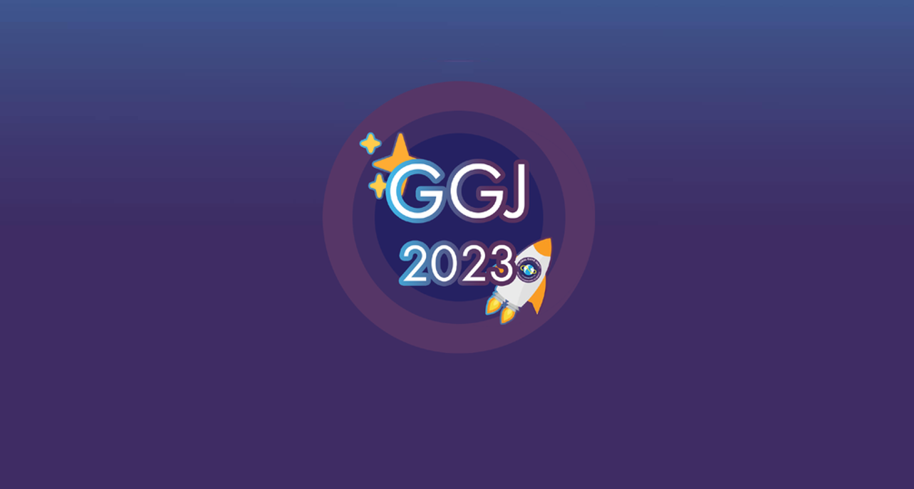

# GGJ 2023

Video game produced in 48 hours for Global Game Jam 2023, feel free to review our [submission]() when it will be available. <!-- todo: make it available -->



## Table of Contents

- [How to play](#how-to-play)
- [About](#about)
  - [Global Game Jam](#global-game-jam)
  - [Diversifiers](#diversifiers)
  - [Controls](#controls)
  - [Context](#context)
- [Synopsis](#synopsis)
- [Platforms](#platforms)
- [Built with](#built-with)
- [Getting started](#getting-started)
  - [Prerequisites](#prerequisites)
  - [Installation](#installation)
- [Contributing](#contributing)
- [Credits](#credits)
  - [Jammers](#jammers)
  - [Musics](#musics)
  - [Graphics](#graphics)
- [License](#license)

## How to play

- Open your favorite web browser
- Go to https://marc-gavanier.itch.io/ggj2023 (Not availabe yet) <!-- todo: make it available -->
- Click on "Run game"
- Enjoy !

## About

### Global Game Jam

- Jam Site: [Sud PICCEL - Brassart (MONTPELLIER)](https://globalgamejam.org/2023/jam-sites/sud-piccel-brassart-montpellier)
- Jam year: [2023](https://globalgamejam.org/2023)
- Theme: not announced yet <!-- todo: add it with video link when announced -->

### Diversifiers

We do not know yet <!-- todo: add diversifiers used in the game -->

### Controls

We do not know yet  <!-- todo: add controls of the game -->

### Context

We do not know yet <!-- todo: add game context -->

## Synopsis

We do not know yet <!-- todo: add game synopsis -->

## Platforms

- Web: [published on itch.io](https://marc-gavanier.itch.io/ggj2023) (Not availabe yet) <!-- todo: make it available -->

## Built with

- [Unity 2020.3.26f1](https://unity.com/) is a real-time engine that helps creators to make cross-platform video games

## Getting started

### Prerequisites

- Download and install [Unity](https://unity3d.com/get-unity/download/)

### Installation

1. Clone the repo

```bash
git clone git@github.com:marc-gavanier/GGJ-2023.git
```

2. Open the project with Unity

## Contributing

- Create your Feature Branch (git checkout -b feat/amazing-feature)
- Commit your Changes (git commit -m "feat: add some amazing feature")
- Push to the Branch (git push origin feat/amazing-feature)
- Open a Pull Request

## Credits

### Jammers

- [Marc Gavanier - Programmer](https://www.linkedin.com/in/marc-gavanier/)
- Nicolas Treiber - Programmer

### Audio

#### Musics

- [Slow Motion - Lexin Music](https://pixabay.com/music/small-emotions-slow-motion-121841/)

#### Sounds

- [ButtonPress - BigDino1995](https://pixabay.com/sound-effects/buttonpress-94482/)

### Graphics

#### Textures

- [Blue Sky - Francesco Ungaro](https://www.pexels.com/photo/blue-sky-281260/)

#### Fonts

- [Cloud - Metal Studio](https://www.dafont.com/fr/cloud-2.font/)

## License

Released under the terms of the `MIT` license. See [LICENSE](./LICENSE) for the full details.
